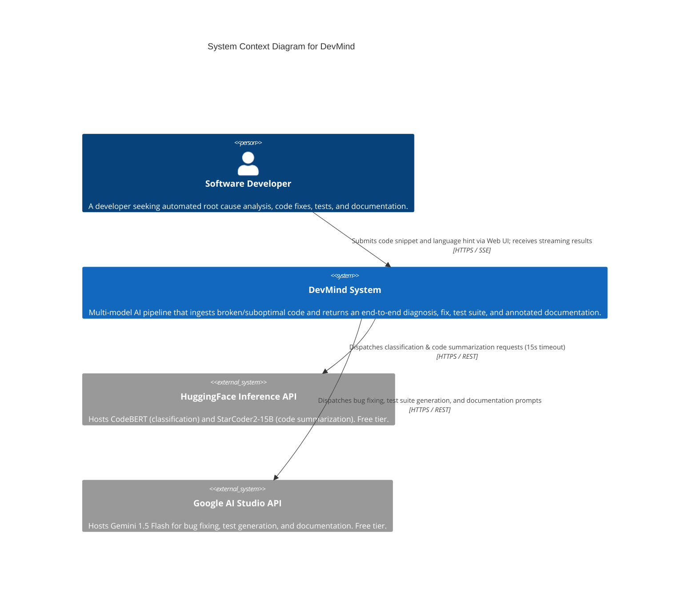
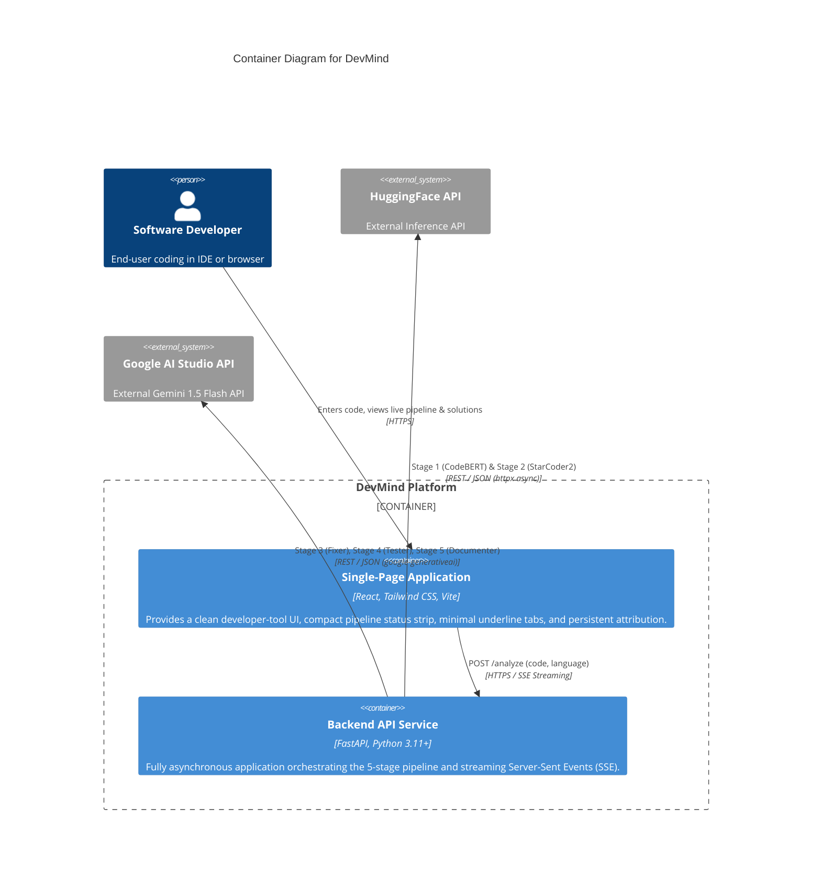
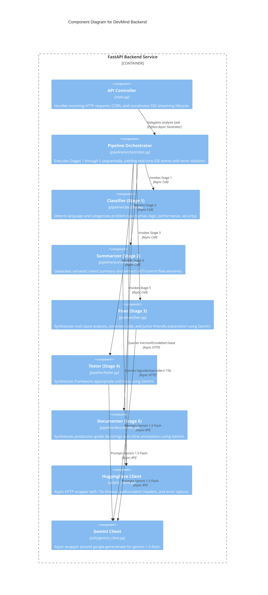

# DevMind Architecture Specification (C4 Model)

This document provides the architectural blueprint for **DevMind**, an AI-powered developer companion, designed according to the **C4 model** (Context, Container, and Component levels) and synthesized with `karak-architecture` standards.

---

## 1. System Context Diagram (Level 1)

The System Context diagram details how software developers interact with DevMind and its external upstream AI providers.

### Context Entities
- **Software Developer**: Interacts with the browser frontend to input broken code, monitor the 5-stage pipeline, and review generated solutions.
- **DevMind**: Central processing platform orchestrating the AI pipeline and streaming real-time stage updates.
- **HuggingFace Inference API (Free Tier)**: Serves specialized lightweight models (`microsoft/codebert-base` and `bigcode/starcoder2-15b`) for low-latency syntactic analysis.
- **Google AI Studio API (Free Tier)**: Serves `gemini-1.5-flash` via `google-generativeai` with no billing required for contextual debugging, test synthesis, and doc generation.

---

## 2. Container Diagram (Level 2)

---

## 3. Component Diagram (Level 3 - Backend Service)

